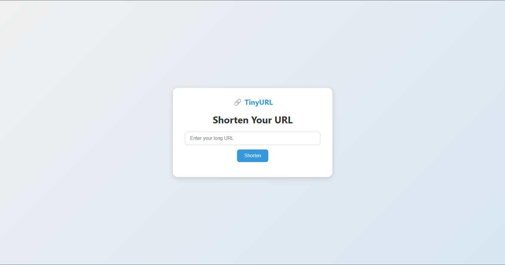
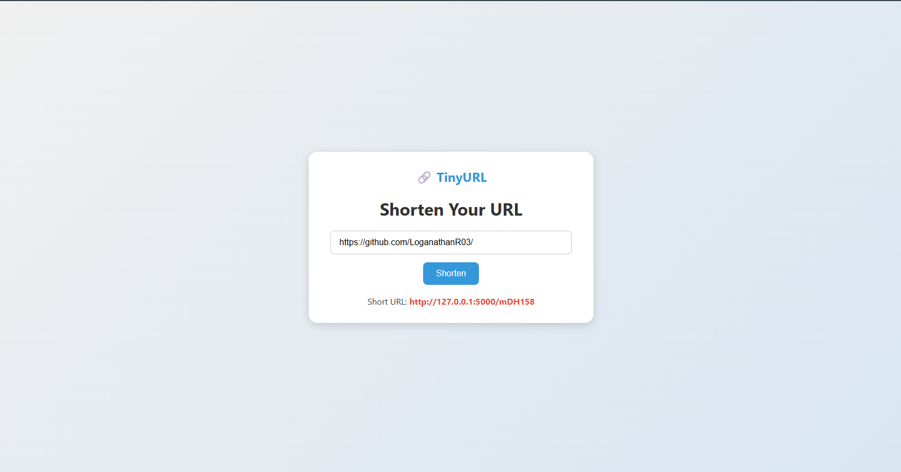

## 🔗 URL Shortener - Flask App

This is a simple **URL Shortener** web application built using **Flask** and **MySQL**.  
Users can input a long URL and get a short version, which redirects to the original URL.

---

## 🚀 Features

- 🔐 Secure hash-based short URL generation
- 📦 Stores long & short URLs in a MySQL database
- 🔁 Tracks number of times each short URL is used
- 🖥️ Clean user interface using HTML (Jinja2 templating)
- 🔧 Built using Python, Flask, and PyMySQL

---

## 🛠️ Technologies Used

- Python 3
- Flask 3.1.1
- MySQL / PyMySQL
- HTML (Jinja2 templating)

---

## 📸 Screenshot

---

